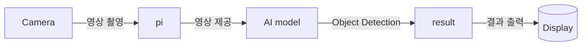

# Project AIpex

* AI Object Detection이 탑재된 스마트 헬맷 올빼미 개발


## High Level Design

* 헬멧의 스크린을 통해 Object Detection과 그 결과를 활용한 증강현실을 착용자에게 제공
* 네비게이션, 후방 카메라 등 자동차에 탑재되어 있는 편의기능을 헬멧에 탑재
## Clone code

* (각 팀에서 프로젝트를 위해 생성한 repository에 대한 code clone 방법에 대해서 기술)

```shell
git clone https://github.com/AIpex-sesac/AIpex
```

## Prerequite

* (프로잭트를 실행하기 위해 필요한 dependencies 및 configuration들이 있다면, 설치 및 설정 방법에 대해 기술)

```shell
python -m venv .venv
source .venv/bin/activate
pip install -r requirements.txt
```

## Steps to build

* (프로젝트를 실행을 위해 빌드 절차 기술)

```shell
cd ~/xxxx
source .venv/bin/activate

make
make install
```

## Steps to run

* (프로젝트 실행방법에 대해서 기술, 특별한 사용방법이 있다면 같이 기술)

```shell
cd ~/xxxx
source .venv/bin/activate

cd /path/to/repo/xxx/
python demo.py -i xxx -m yyy -d zzz
```

## Output

* (프로젝트 실행 화면 캡쳐)


## Appendix

* (참고 자료 및 알아두어야할 사항들 기술)

## 팀원 소개 및 역할 분담
  | Name | Role |
  |----|----|
  | 남대문 | Development |
  | 성시경 | Data management, 3D Modeling |
  | 장태규 | Project lead, Architect |
  | 최종인 | UI design, Development |